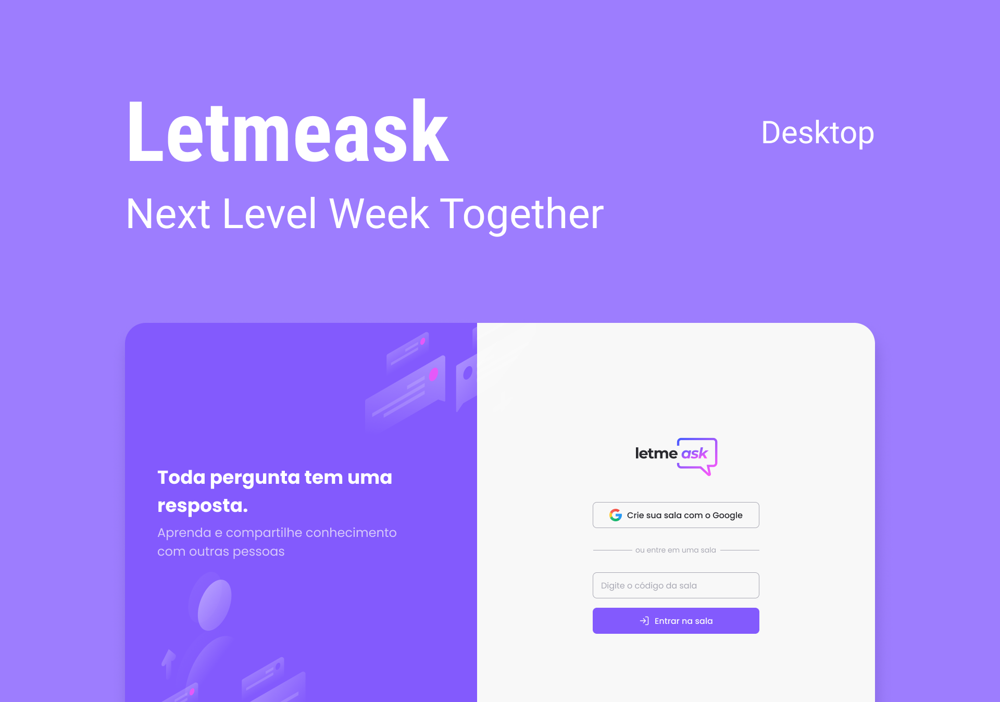

<p align="center">
  
</p>

<p align="center">
 
 
 
</p>

---

<br />

<p align="center">
  <kbd>
    
  </kdb>
</p>

<h1> 
  Sobre
</h1>

<p style="font-size: 1.1rem; width: 80%" >
  <strong>Letmeask </strong> é uma aplicação feita para facilitar as pergutas de seus espectadores, 
  destacando as peguntas mais gostadas pela propria comunidade.
</p>
<br/>

<p style="font-size: 1.2rem;">
  Você pode ver o projeto no ar 
  <a href="https://nlw06letmeask.web.app">aqui</a>.
</p>
<br />


# 🔧 Ferramentas usadas 

- [React](https://pt-br.reactjs.org/)
- [FireBase](https://firebase.google.com/)
- [TypeScript](https://www.typescriptlang.org/)

<br />

# Como rodar em minha maquina?

```bash
# clonar o repositorio
$ git clone https://github.com/kelwinv/nlw06-letmeask.git

# entrar na pasta
$ cd nlw06-letmeask
```

Para iniciá-lo, siga os passos abaixo:
```bash
# Instalar as dependências
$ yarn

# Iniciar o projeto
$ yarn start
```

<br />

## 📝 License

Esse projeto está sob a licença MIT. Veja o arquivo [LICENSE](LICENSE.md) para mais detalhes.
